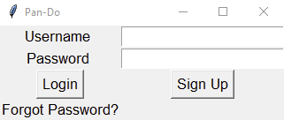

# Pan-Do
Desktop widget for Windows 10 based on Todoist api.

## Authors
  John Hamilton (Electrum)  
  Andrew Pokorny  
  Yujia Wu (Emelye)  
  Joe Malik  

## Installation
  > The installed is in the root folder named "Pan-Do Installer". Click to download Pan-Do Installer, then install it on your desktop.
## How to use Pan-Do
>1. After installing Pan-Do, click on the icon, a login page will pop up.   


>2. Enter your email address as Username if you already had an account then click "Login", otherwise, click on "Register New Account", it will take you to the sign up page. "Forgot Password" will take you to a web page to get you your password back. 


>3. "Back to Login" will take you back to the Login Page, "Sign Up" will register a new Todoist account for you and directly take you to the todo-list main page:  


>4. This is the main page, add new task is at the top, by hitting the Enter key, new task will be added from the top.  


>5. Complete a Task: 1) Left click on the checkbox in the front of the task, or 2) Right click on the task then select "Complete".

>6. If you need to edit a task, select "Edit", then perform the editing.   


>7. Right click on either "Add Task" bar on the top, or on the title bar.  


>8. To force sync, click "Sync".

>9. To deselect when multiple tasks are selected, click "Deselect".

>10. Pan-Do also supports basic keyboard functionalities, but if you want to cut and paste from the widget, click on the corresponding bars. 

>11. To swap to another project, hover over "Swap Project", then choose your desired project.  


## Middleware
  >The middleware is designed in a way that separates it from the GUI. It takes in a class object in its constructor that has certain requirements.  This is how it interacts with the GUI.

### Methods
```
gui.setAddListener(add)
gui.setRemoveListener(delete)
gui.setProjectSwapListener(projectSwap)
gui.setProjectNamesListener(setProjectNames)
gui.setForceSync(forceSync)
gui.setEditListner(edit)
gui.setTaskMovedListener(moveTask)  
```
That take in a Listener class. The listener class has the structure of having a single `.notify(vals)` method. The vals is a list, whose structure depends what information the method passed into the listener accepts.  

It also requires the method   
`gui.setCurrentProject(self.get_project().name)`  
which takes in the current projects name

And   
`gui.addListOfTasks([t.content for t in tasks])`  
which takes in the list of strings for the names of the tasks

It also can require the methods, but they are currently commented out  
`gui.please_wait()`  
`gui.stop_waiting()`

Which are how the middleware communicates to the GUI to stop or resume accepting inputs.  This is used to prevent the application from getting kicked from the Todoist servers
Requires the `gui.displayError(“error”)`

So that the middleware can tell the gui when an error occured

And lastly  
`gui.startGui()`  
This is how the middleware tells the GUI that it has finished passing what info it needs to pass to the GUI, and the GUI can now start.

### Queue and PingLimit

The middleware utilizes an execution queue and a max ping limit to allow it to control how many times the server is pinged.  Since the Todoist API limits the amount of sync requests per minute to 50, and the API we are using to talk to the Todoist API does a sync almost every time a method is called, we keep track of how many pings happen within a minute, and if it approaches 50, it will halt the queue and tell the GUI to inform the user to wait.  After a minute has passed it will reset the counter to 0 and tell the GUI to resume.

## GUI


